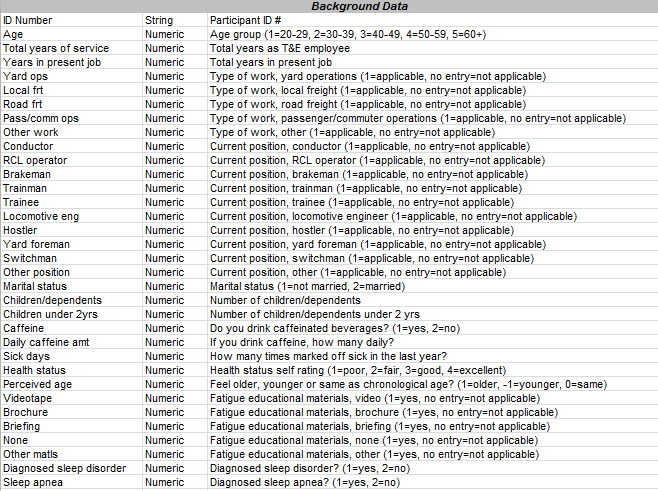

##Data
We imported our data into Tableau.

Our **dataset** is compiled of data from railroad employees and their sleep and activity patterns.
1) TBackground
2) TSleepAlert
3) TActivity

**Variable Definitions**  
Here is a list of definitions for all the variables.  
  
  
  

**Reformatting**   
Reformatted the data.  
  

**Tableau Data Sourcing from Oracle**  
Pull information from SQL Server into Tableau.  


##Data Blending Visualizations  

**Visualization 1** 
**Title:** Sleep quality vs Sleep Location/Length  
**Analysis**:  Although slight differences in sleep length at the low and high of each sleep quality, there appears to be a near 1 to 1 relation between sleep quality and sleep length regardless of sleep location.    
**Columns**:  Sleep Quality  
**Rows**: Sleep Location, AVG(Sleep Length)   
**Color**: CNT(Sleep Length)   
**Size**: CNT(Sleep Quality)   
**Steps**:  
1. Plotted sleep quality versus sleep location and average sleep length  
2. Colored by sleep length and size-organized by sleep quality  
3. Filtered by sleep location to get rid of the null values


**Visualization 2**   
**Title**: Caffeine Amount vs Start/End Alertness  
**Analysis**: 1-3 cups of caffeine shows the highest average start/end alertness with the smallest drop in start to end alertness.    
**Columns**: Caffeine Amount    
**Rows**: AVG(Start Alertness), AVG(End Alertness)   
**Color**: CNT(Caffeine Amount)  
**Size**: Start/End Alertness  
**Steps**:  
1. Plotted caffeine amount versus average start and end alertness levels  
2. Colored by sleep quality with the highest sleep quality being blue and lowest being red  
3. Filtered to remove null values


**Visualization 3**  
**Title**: Years in Present Job vs Stress  
**Analysis**:  The overall stress levels drop after year 16, with number of employees decreasing as well.   
**Columns**: Years in present job  
**Rows**: AVG(Work Schedule), AVG(Job Security), AVG(Staffing)  
**Size**: CNT(Years in present job)  
**Steps**:  
1. Plotted years present in job versus average work schedule, average job security, and average staffing  
2. Used sizze to discrimintate the count of the population present at each years in present job value
  

**Visualization 4**    
**Title**: Age vs Weekly Work Hours  
**Analysis**: Employees overall worked on average 40-59 hours a week.    
**Columns**: Age 
**Rows**: Weekly Work Hours  
**Size**: CNT(Age)  
**Steps**:  
1. Plotted age versus weekly work hours
2. Weekly work hours variables were calculated by grouping
 

**Visualization 5**    
**Analysis**: Overview of factors that related to sleep quality. Showed that falling asleep was the factor that changed the most with changing sleep quality.
**Columns**: Sleep Quality  
**Rows**: Measure Names  
**Color**: Measure Values  
**Steps**:  
1. Plotted sleep quality versus measure names  
2. Filtered based off of sleep quality to get rid of the nulls  
3. Colored by measure values with 5 being the darkest and white being the lowest


**Visualization 6**    
**Analysis**: Time Spent per Activity. Looked at the time spent per person per activity type and found that sleep, personal time, and work time were the most time intensive activities.
**Columns**: ID Number  
**Rows**: Activity, AVG(Activity Time)  
**Color**: Activity  
**Steps**:  
1. Plotted ID Number against activity type and average time spent doing each activity  
2. Colored by activity type  
3. Created a calculated field "activitytime" that subtracted end time from start time to get the total time for an activity. If the start time was later than the end time I had an if else statement to handle it: IF [Start Time (Activity)]>[End Time (Activity)] THEN 24 - [Start Time (Activity)] + [End Time (Activity)] ELSE [End Time (Activity)] - [Start Time (Activity)] END
 

**Visualization 7**    
**Analysis**: Time Spent per Activity version 2. This plot was a more detailed display of the previous plot; it included labels of percentages of total activity per activity.  
**Columns**: AVG(Activity Time)   
**Rows**: ID Number  
**Color**: Activity  
**Steps**:  
1. Plotted average activity time vs ID number  
2. Colored by activity type  
3. Labeled each activity type using a quick calculation (percent of total)  
4. Ordered by total activity time descending
 

**Visualization 8**    
**Analysis**: Group Analysis. This plot showed no relation between individuals who had more work time, more personal time, or no difference between the two.  
**Columns**: ID Number  
**Rows**: Falling Asleep, Sleep Quality, Sleep Length, Sleep Loss, Daily Caffeine
**Steps**:  
1. Used groups defined through visualization 7 and plotted against the various rows  
2. Filtered using those predefined groups  
 

**Visualization 9**    
**Analysis**: Age Status per Job. Showed that Brakemen differed the most from the total average age of employees and were perceived to be older than they actually were. 
**Columns**: Job  
**Rows**: AVG(Age), AVG(Perceived Age)   
**Steps**:  
1. Job was listed as a dimension, so I had to make a separate graph for each position  
2. THe column was filtered to remove any null values  
3. Each row was labelled with it's respective value  
4. The separate graphs for each position were combined on the dashboard feature of Tableau

 

**Visualization 10**    
**Title**: Average Caffeine Level vs Alertness (Inner Join)    
**Analysis**: Expect alertness to go up as caffeine amount went up, but data showed opposite trend.  

```{r fig.width=10, fig.height=10}
source("../02 Data Wrangling/df_alert_caffeine.R", echo= TRUE)
```

**Visualization 11**    
**Title**: Sleep Quality Compared to Activity Type (Left Join)    
**Analysis**: Expected sleep quality to be highest for personal time, data showed that sleep quality was lowest at personal time.  

```{r fig.width=10, fig.height=10}
source("../02 Data Wrangling/df_sleep_activity.R", echo= TRUE)
```

**Visualization 12**    
**Title**: Alertness Levels Compared to Schedule Type (Inner Join)  
**Analysis**: Expected alertness level to be higher for straight thru schedule employees, but data showed no strong relation between two factors.  

```{r fig.width=10, fig.height=10}
source("../02 Data Wrangling/df_alertness_schedtype.R", echo= TRUE)
```

**Visualization 13**    
**Title**: Sleep Quality and Length Compared to Job Length (Right Join)    
**Analysis**: No strong relation between sleep quality and length to job length. Plot shows high concentration of employees with sleep length 4 and and sleep quality 4 from job length of 5 to 15.  

```{r fig.width=10, fig.height=10}
source("../02 Data Wrangling/df_sleep_joblength.R", echo= TRUE)
```

**Visualization 14**    
**Title**: Total Years Worked vs Job Security and New Hire Oversight    
**Analysis**: Expected to see job security stress to go down as total years worked went up, but did not see strong relation between the two factors.  

```{r fig.width=10, fig.height=10}
source("../02 Data Wrangling/df_jobsecurity_yearsofservice.R", echo= TRUE)
```
 
