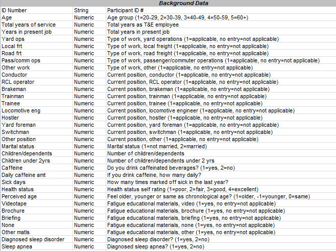
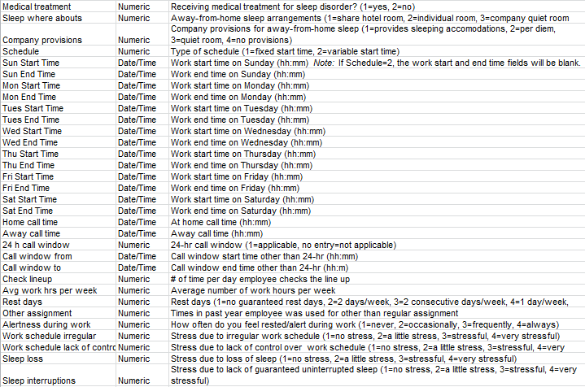
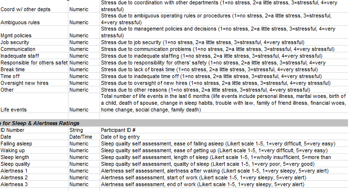

##Data
We imported our data into Tableau.

Our **dataset** is compiled of data from railroad employees and their sleep and activity patterns.
1) TBackground
2) TSleepAlert
3) TActivity

**Variable Definitions**
Here is a list of definitions for all the variables.

##Four Data Blending Visualizations

**Visualization 1** 
**Analysis**:  Although slight differences in sleep length at the low and high of each sleep quality, there appears to be a near 1 to 1 relation between sleep quality and sleep length regardless of sleep location.    
**Columns**:  Sleep Quality  
**Rows**: Sleep Location, AVG(Sleep Length)   
**Color**: CNT(Sleep Length)   
**Size**: CNT(Sleep Quality)   

**Visualization 2**   
**Analysis**: 1-3 cups of caffeine shows the highest average start/end alertness with the smallest drop in start to end alertness.    
**Columns**: Caffeine Amount    
**Rows**: AVG(Start Alertness), AVG(End Alertness)   
**Color**: CNT(Caffeine Amount)  
**Size**: Start/End Alertness  

**Visualization 3** 
**Analysis**:  The overall stress levels drop after year 16, with number of employees decreasing as well.   
**Columns**: Years in present job  
**Rows**: AVG(Work Schedule), AVG(Job Security), AVG(Staffing)  
**Size**: CNT(Years in present job)  
  

**Visualization 4**    
**Analysis**: Employees overall worked on average 40-59 hours a week.    
**Columns**: Age 
**Rows**: Weekly Work Hours  
**Size**: CNT(Age)  
  